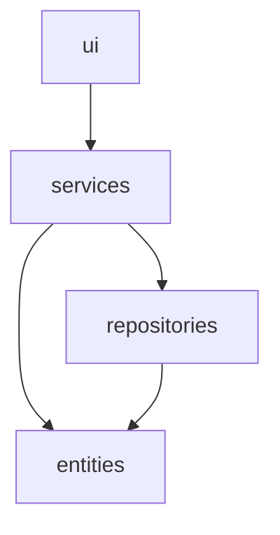
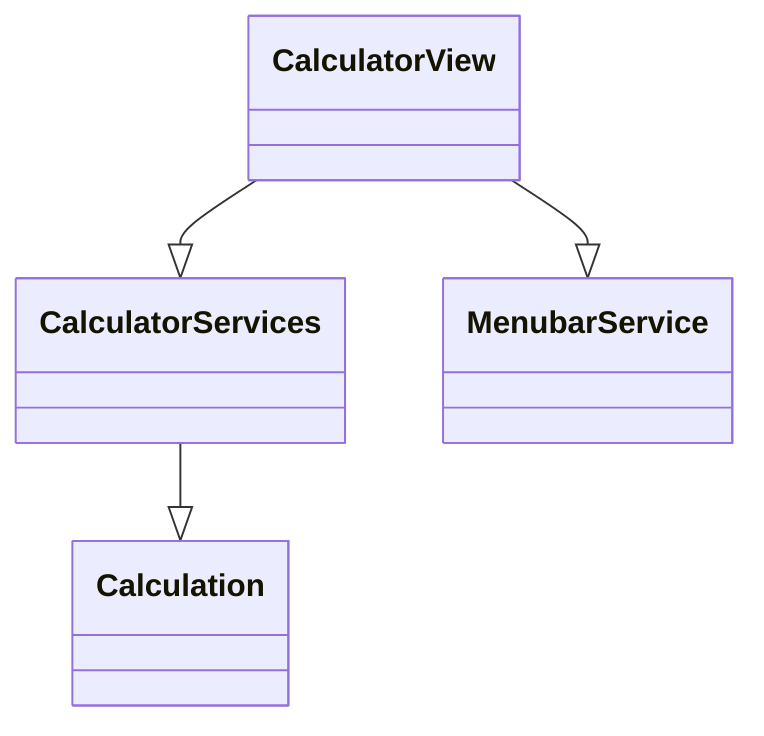

# Arkkitehtuurikuvaus

## Rakenne

Sovellus koittaa noudattaa referenssisovellukset rakennetta:

## Sovelluslogiikka

CalculatorView lähettää komennot CalculatorServices ja MenubarService kun laskimen näppäimiä painetaan. Sovelluksen sovelluslogiikasta vastaavat luokat CalculatorServices ja MenubarService. CalculatorServices tallentaa laskut Calculation luokkaan

