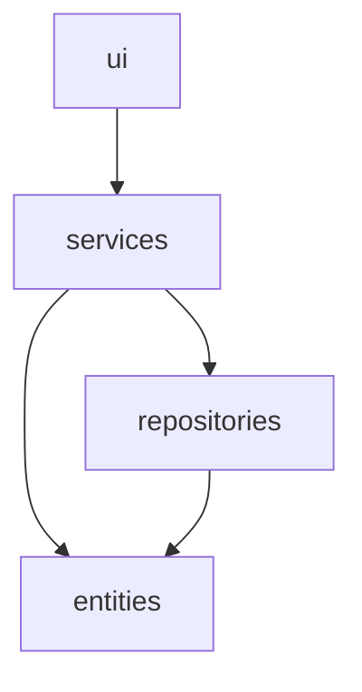
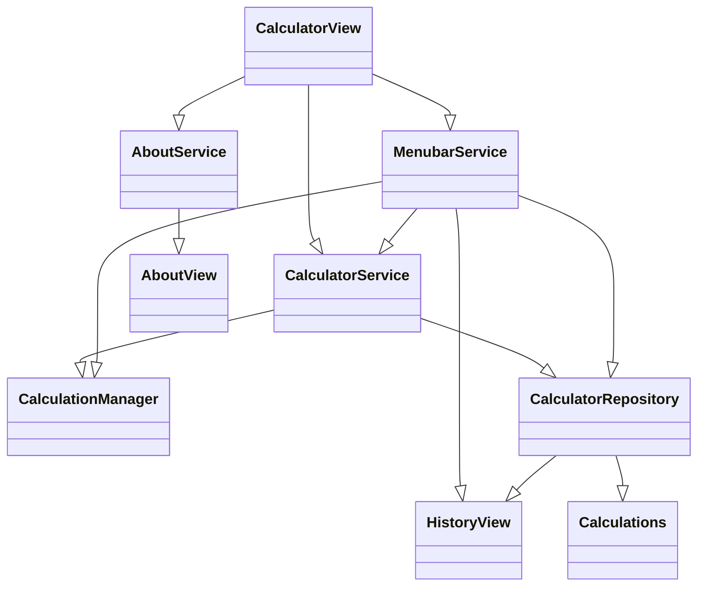
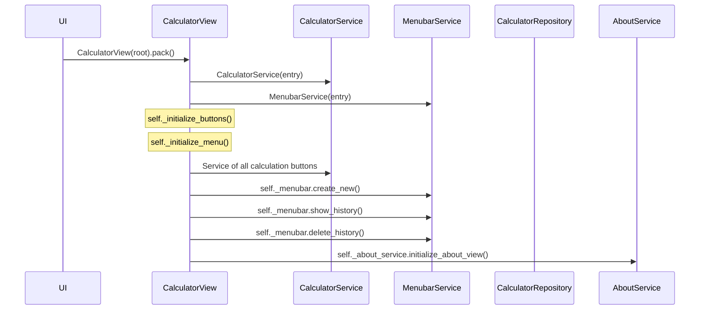

# Arkkitehtuurikuvaus

## Rakenne

Sovellus koittaa noudattaa referenssisovellukset rakennetta:

## Sovelluslogiikka

CalculatorView lähettää komennot CalculatorService ja MenubarService kun laskimen näppäimiä painetaan. Sovelluksen sovelluslogiikasta vastaavat luokat CalculatorServices ja MenubarService. CalculatorServices tallentaa laskut Calculation luokkaan. **HUOM!** Lisäsin lisää toiminnallisuuksia. Päivitän tämän tekstin myöhemmin ja teen luokkadiagrammista tarkemma.

## Sekvenssikaavio

**HUOM!** Tämä on alku. Minun piti tehdä tätä koko tiistai mutta koska menetin 6-7 tuntia työaikaa minun piti korjata asioita, jotta saan julkastua toimivan version. Tämä kuvaa nappien toimintaa.

