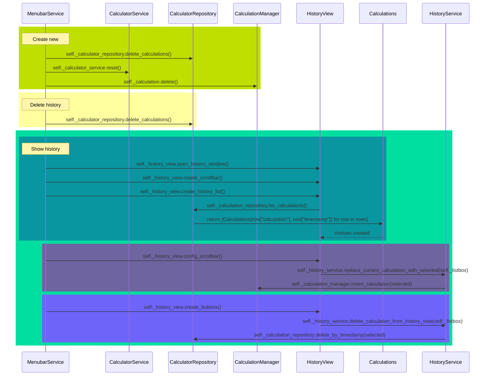

# Arkkitehtuurikuvaus

## Rakenne

Sovellus noudattaa referenssisovelluksen rakennetta:

# Käyttöliittymä

Käyttöliittymä sisältää kolme erillistä näkymää:

- Laskimen perusnäkymä
- Historia näkymä
- Laskimen tiedot-näkymä

Jokainen näkymä toteutettu omana luokkanaan. Laskimen perusnäkymä pysyy aina näkyvissä. Historia ja laskimen tiedot avautuvat uuteen ikkunaan. Näiden ikkunoiden sulkeminen ei vaikuta laskimen perusnäkymään. Sulkemalla laskimen perusnäkymän sulkeutuu kaikki ikkunat. Käyttöliittymä on pyritty eriyttämään sovelluslogiikasta.

### Tämä kaavio kuvaa menubarin ja nappien alustamista ja toiminnallisuutta.

[1] _Service of all calculation buttons_ käsittää kaikki laskimen napit.

## Sovelluslogiikka

#### Seuraaviin kaavioihin on kuvattu pääpiirtein luokkien väliset toiminnot

CalculatorView lähettää komennot CalculatorService MenubarService ja AboutService luokille, kun laskimen näppäimiä painetaan. Sovelluksen sovelluslogiikasta vastaavat luokat CalculatorService, MenubarService, AboutService sekä HistoryService. CalculatorService tallentaa laskut CalculationManager luokkaan. Laskutoimitukset tallennetaan pysyvästi CalculatorServicestä CalculatorRepositoryyn, jossa ne lisätään tietokantaan. CalculatorRepositoryssa muodostetaan olio Calculations, jossa on kaikki laskutoimitukset. Nämä laskutoimutukset tulostetaan HistoryViewissä. Jos HistoryViewissä laskutoimituksia muokataan nämä muokkaukset tapahtuvat HistoryServicessä ja tallentuvat sieltä CalculatorRepositoryyn. AboutService alustaa AboutViewin näkymän.

### CalculatorService

Tämä kaavio kuvaa CalculatorServicen, CalculationManagerin ja CalculatorRepositoryn välistä toimintaa. CalculatorService vastaa laskimen sovelluslogiikasta. Se lähettää käskyt CalculationManagerille, joka hoitaa laskutoimitusten käsittelyn. CalculatorService kutsuu CalculationManageria, joka palauttaa laskutoimituksen, joka tulostetaan laskimen käyttöliittymään. Painamalla '='-nappia CalculatorService ratkaisee laskutoimituksen ja lähettää sen CalculatorRepositorylle, joka tallentaa laskutoimituksen ja vastauksen tietokantaan.

### MenubarService

Tämä kaavio kuvaa Menubarin toimintaa ja sitä miten se on liitoksissa muihin luokkiin.

## Tietojen pysyväistallennus

Pakkauksen _repositories_ luokka `CalculatorRepository` hoitaa laskutoimitusten tallentamisen. Laskutoimitukset tallennetaan SQLite3-tietokantaan. Luokka noudattaa repository-suunnittelumallia.

Sovelluksen juuressa oleva [.env](../.env) -konfiguraatiotiedosto määrittelee tiedostojen nimet.

Tietokannassa on taulu `Calculations`, johon tallennetaan aikaleima ja laskutoimitus, kun käyttäjä painaa '='-merkkiä.

Tietokanta alustetaan tiedostossa [initialize_database.py](../src/initialize_database.py)

## Ohjelman rakenteeseen jääneet heikkoudet

### CalculatorService-luokka

[CalculatorServices](../src/services/calculator_service.py) -luokka pitää sisällään nappien toiminnallisuuden ja virheiden käsittelyn. Tarkoitukseni oli jakaa tämä luokka kahteen osaan, jossa virheiden käsittely eriytetään omaksi luokaksi. Luokka on mielestäni liian suuri.

### Luokkien koot

Sovellusta kehittäessä taitoni myös kehittyivät. Kävin samaan aikaan ohjelmistotuotanto-kurssia ja lisäsin siellä oppimaani ohjelmaan. Aloin eriyttämään toiminnallisuuksia omiksi luokikseen. Jälkikäteen tämä oli haastavaa riippuvuuksien takia. Kurssin alussa olin toteuttanut CalculatorService-luokan ilman entryn injektoimista, mutta lisäsin sen luokan riippuvuudeksi myöhemmin. Tämä tuotti paljon ongelmia myöhemmässä vaihteessa sovellusta. Koitin rakentaa luokkia:
 - **ErrorHandler**, joka huolehtii virheistä
 - **EntryHandler**, joka hoitaa laskimen näytölle tulevasta tulosteesta
 - **CalculationChecker**, joka huolehtii ettei laskuun lisätä väärää tietoa esim. kahta pistettä numerosarjaan

Mutta riippuvuudet tekivät luokkien tekemisestä todella hankalaa ja tajusin, ettei aikani riitä saamaan ohjelmaa loppuun jos panostan niihin enemmän aikaa. Sen takia osa luokista sisältää enemmän metodeita kuin toiset.

### **Eval**-komennon käyttäminen

Evalin käyttäminen laskutoimitusten ratkaisemiseen ei ole hyvä käytänne. Olisin halunnut rakentaa, jonkinlaisen algoritmin ratkaisemaan laskut, mutta ongelman tuotti sulkeet. En keksinyt siihen vastausta, enkä halunnut käyttää siihen liikaa aikaa, joten jätin sen viimeiseksi asiaksi tehtävälistalla.