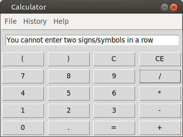
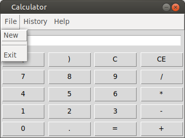
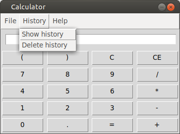
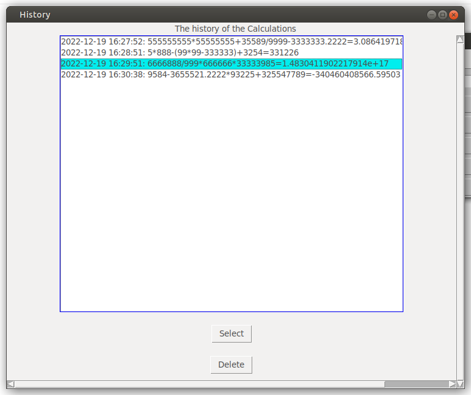
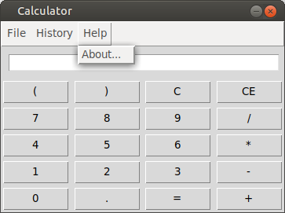
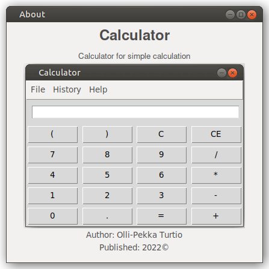

# Käyttöohje

Lataa projektin viimeisin release lähdekoodi valitsemalla Assests-osion alta _Source code_.

## Konfigurointi

Tallennukseen käytettävien tiedostojen nimiä voi halutessaan konfiguroida käynnistyshakemistossa _.env_-tiedostossa. Tiedostot luodaan automaattisesti _data_-hakemistoon, jos niitä ei siellä vielä ole. Tiedoston muoto on seuraava:

```
DATABASE_FILENAME=database.sqlite
```

## Ohjelman käynnistäminen

Ennen kuin käynnistät ohjelman, sinun tulee asentaa riippuvuudet komennolla:

```bash
poetry install
```

Tämän jälkeen alusta tietokanta komennolla:

```bash
poetry run invoke build
```

Lopuksi käynnistää sovellus komennolla:

```
poetry run invoke start
```

## Laskimen näkymät

### Laskimen perusnäkymä

Laskimen käyttöliittymä on englanniksi.


Voit suorittaa perus-laskutoimituksia näppäilemällä nappeja. Jos teet väärän laskutoimituksen ohjelma ilmoittaa siitä.

Esimerkki virheilmoituksesta:



### Uuden laskimen luonti ja poistuminen laskimesta

Valitsemalla `File` avautuu alavalikko.

Valitsemalla `New` voit alustaa uuden laskimen, myös kaikki vanhat laskutoimitukset häviää.

Valitsemalla `Exit` poistut laskimesta.



### Historia näkymään siirtyminen ja historian poistaminen

Valitsemalla `History` avautuu alavalikko.

Valitsemalla `Show history` avautuu uusi ikkuna, jossa näkyy vanhat laskutoimitukset.

Valitsemalla `Delete history` voit poistaa historiasta kaikki laskutoimitukset.



### Historia näkymä
Historia näkymässä voit tarkastella vanhoja laskutoimituksia. Näet kellonajan milloin laskutoimitus on tallentunut historiaan ja sen perässä näet vanhan laskutoimituksen. Kun laskutoimitus on valittu, voit valita `Delete`, joka poistaa laskutoimituksen tai voit valita `Select`, joka kopioi laskutoimituksen laskimen ruudulle. **HUOM!** Kun laskutoimitus kopioidaan ruudulle sitä ei näy samantien. Painamalla jotain laskimen nappia esim. plus-nappia laskutoimitus ilmestyy näkyviin.



### Help näkymä
Valitsemalla `Help` avautuu alavalikko.

Valitsemalla `About...` avautuu uusi ikkuna, jossa näkyy tietoja ohjelmasta.



### About näkymä

About näkymässä näet kuvan laskimen perusnäkymästä, laskimen tekijän nimen ja julkaisuvuoden.

