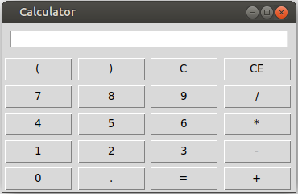

# Vaatimusmäärittely

## Sovelluksen tarkoitus

Sovellus on tkinterillä toteutetttu laskin eli siinä on graafinen käyttöliittymä. Sovelluksella voi suorittaa perus laskutoimituksia.

## Käyttäjät

Käyttöliittymään ei ainakaan vielä tarvitse kirjautua. Laskinta voi alkaa käyttämään suoraan, mutta olen suunnitellut käyttäjäprofiilin luomista.

## Käyttöliittymäluonnos

## Perusversion toiminnallisuus

- Ohjelman käynnistyessä latautuu laskin näkymä
- Historia painiketta painamalla näkyy menneet laskutoimitukset tai laskutoimitukset kirjautuvat suoraan laskimen näkymään
- Laskutoimitukset kirjautuvat tietokantaan
- Laskimella voi tehdä yhteen- vähennys- jako- ja kertolaskuja
- Laskimessa voi käyttää sulkeita
- Laskutoimituksen voi poistaa tai sitä voi korjata pyyhkimällä viimeisin syöte
- Laskimella voi laskea kokonais- tai liukulukuja